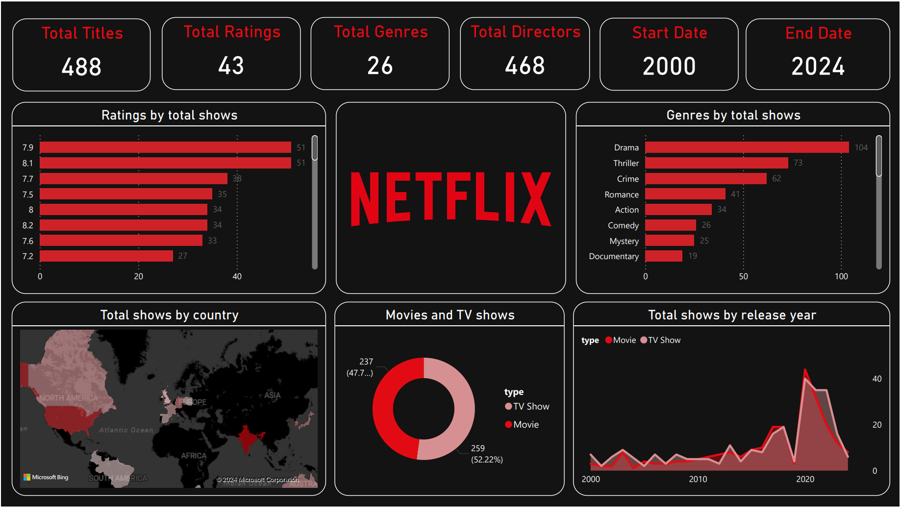

# Netflix Dashboard Analysis

This project analyzes Netflix Prime Movies and TV Shows using Power BI. The dashboard provides insights into:

- **Total shows by country**: Comparison of total TV shows and movies by region.
- **Movies and TV Shows by release year**: Trends over time.
- **Ratings by total shows**: Average ratings for different types of content.
- **Genres by total shows**: Popular genres on Netflix.
- **Key Metrics**:
  - Total Titles: 488
  - Total Ratings: 43
  - Total Directors: 468
  - Total Genres: 26
  - Start Year: 2000
  - End Year: 2024
